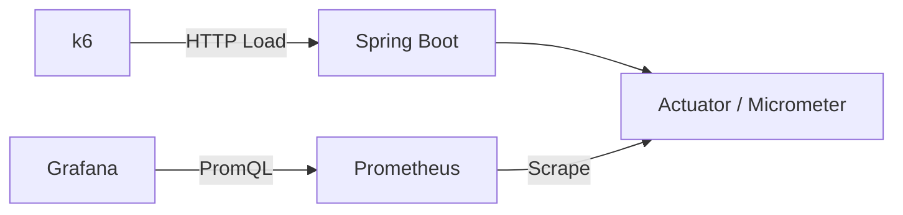

# System Design Template

Spring Boot 기반 시스템 설계 프로젝트를 빠르게 시작하고,
부하 테스트와 모니터링을 통해 설계 선택을 검증하기 위한 공통 템플릿입니다.

새로운 시스템 설계 주제를 진행할 때 이 Repository를 기반으로 별도의 Repository를 생성하고, 프로젝트별로 필요한 데이터베이스, 캐시, 메시지 브로커 등을 추가합니다.

## 목표

- 공통 Spring Boot 실행 환경 제공
- Docker Compose 기반 로컬 실험 환경 제공
- k6 기반 부하 테스트 시나리오 제공
- Prometheus와 Grafana 기반 메트릭 관측
- 설계 및 실험 과정을 동일한 문서 형식으로 기록
- Platform Thread와 Virtual Thread 비교 환경 제공

## 기술 스택

| 구분 | 기술 |
|---|---|
| Language | Java 25 |
| Framework | Spring Boot 4.1 |
| Build | Gradle |
| API | Spring MVC |
| Metrics | Spring Boot Actuator, Micrometer |
| Load Test | k6 |
| Monitoring | Prometheus, Grafana |
| Container | Docker, Docker Compose |

## Java 25 선택 이유

Java 25는 가상 스레드가 정식 기능으로 제공된 Java 21 이후의 개선 사항을 포함하는 LTS 버전입니다.

시스템 설계 프로젝트에서는 데이터베이스, Redis, 메시지 브로커, 외부 API처럼 블로킹 I/O가 자주 발생합니다. 따라서 동기식 Spring MVC 구조를 유지하면서 Platform Thread와 Virtual Thread의 동시 처리 성능을 비교하기 위해 Java 25를 사용합니다.

가상 스레드는 기본적으로 비활성화되어 있으며 환경변수로 전환합니다.

```dotenv
VIRTUAL_THREADS_ENABLED=false
```

실제 블로킹 I/O가 포함된 프로젝트에서는 동일한 k6 시나리오로 다음 실험을 수행합니다.

```text
실험 A: Java 25 + Platform Thread
실험 B: Java 25 + Virtual Thread
```

비교 지표:

- RPS
- p95 및 p99 응답 시간
- 오류율
- CPU 사용률
- JVM Heap
- 활성 스레드 수
- DB Connection Pool 대기

## 전체 구조



## 디렉터리 구조

```text
.
├── src
│   ├── main
│   └── test
├── k6
│   ├── smoke-test.js
│   ├── load-test.js
│   └── stress-test.js
├── monitoring
│   ├── prometheus
│   │   └── prometheus.yml
│   └── grafana
│       ├── dashboards
│       └── provisioning
├── docs
│   ├── 01-requirements.md
│   ├── 02-capacity-estimation.md
│   ├── 03-architecture.md
│   ├── 04-experiment.md
│   └── 05-retrospective.md
├── scripts
├── Dockerfile
├── docker-compose.yml
└── README.md
```

## 제공 API

### Ping

애플리케이션 실행 여부와 기본 HTTP 메트릭을 확인하기 위한 API입니다.

```http
GET /api/v1/ping
```

응답:

```json
{
  "message": "pong"
}
```

## 실행 전 요구사항

- Docker Desktop
- Docker Compose v2
- Java 25
- Python 3
- Git

Docker Compose를 사용하면 로컬 Java와 Gradle이 없어도 전체 환경을 실행할 수 있습니다.

## 새 프로젝트 시작하기

GitHub의 `Use this template`로 Repository를 생성한 뒤 Clone합니다.

```bash
./scripts/init-project.sh \
  url-shortener \
  com.backendsystemdesignlab.urlshortener \
  "URL Shortener"
```

## 실행 방법

### 1. 환경변수 파일 생성

```bash
cp .env.example .env
```

기본 설정:

```dotenv
APP_NAME=system-design-template

APP_PORT=8080
PROMETHEUS_PORT=9090
GRAFANA_PORT=3000

GRAFANA_ADMIN_USER=admin
GRAFANA_ADMIN_PASSWORD=admin

VIRTUAL_THREADS_ENABLED=false
```

기본 Grafana 계정은 로컬 실험용입니다. 외부 환경에서는 반드시 변경해야 합니다.

### 2. 전체 환경 실행

```bash
./scripts/start.sh
```

직접 실행하려면:

```bash
docker compose up --build -d
```

### 3. 실행 상태 확인

```bash
docker compose ps
```

Spring Boot 컨테이너가 다음 상태여야 합니다.

```text
healthy
```

### 4. 서비스 접속

| 서비스 | 주소 |
|---|---|
| Spring Boot | http://localhost:8080 |
| Health Check | http://localhost:8080/actuator/health |
| Prometheus Metrics | http://localhost:8080/actuator/prometheus |
| Prometheus | http://localhost:9090 |
| Grafana | http://localhost:3000 |

Grafana 기본 계정:

```text
ID: admin
Password: admin
```

## 부하 테스트

k6는 상시 실행하지 않고 테스트 시 일회성 컨테이너로 실행됩니다.

### Smoke Test

API가 기본적으로 정상 동작하는지 검증합니다.

```bash
./scripts/run-smoke-test.sh
```

기준:

- HTTP 실패율 1% 미만
- p95 500ms 미만
- Check 성공률 99% 초과

### Load Test

예상 부하에서 성능 기준을 만족하는지 검증합니다.

```bash
./scripts/run-load-test.sh
```

기준:

- HTTP 실패율 1% 미만
- p95 200ms 미만
- p99 500ms 미만

### Stress Test

부하 증가에 따라 시스템이 어느 지점에서 불안정해지는지 관찰합니다.

```bash
./scripts/run-stress-test.sh
```

Stress Test에서는 다음 변화를 확인합니다.

- 처리량 증가 또는 정체
- p95 및 p99 급증
- 5xx 오류 발생
- CPU 사용률 상승
- JVM Heap 및 GC 변화

## 모니터링

Grafana에서 다음 경로로 이동합니다.

```text
Dashboards
→ System Design
→ Spring Boot Overview
```

기본 대시보드에서 다음 지표를 확인할 수 있습니다.

- Requests Per Second
- p95 Response Time
- p99 Response Time
- 5xx Error Rate
- JVM Heap Used
- Process CPU Usage

Prometheus Target 상태:

```text
http://localhost:9090/targets
```

`spring-boot` Target이 `UP`이어야 합니다.

## 애플리케이션 직접 실행

### 테스트

```bash
./gradlew clean test
```

### 실행

```bash
./gradlew bootRun
```

### JAR 빌드

```bash
./gradlew clean bootJar
```

결과:

```text
build/libs/app.jar
```

## 종료 및 정리

### 서비스 종료

```bash
./scripts/stop.sh
```

Prometheus와 Grafana의 Named Volume은 유지됩니다.

### 컨테이너와 빌드 결과 정리

```bash
./scripts/clean.sh
```

### 수집 데이터까지 완전히 삭제

```bash
./scripts/clean.sh --volumes
```

`--volumes`를 사용하면 Prometheus와 Grafana의 저장 데이터가 삭제됩니다.

## 프로젝트 진행 절차

각 시스템 설계 프로젝트는 다음 순서로 진행합니다.

1. 문제 및 요구사항 정의
2. 용량 산정
3. 초기 아키텍처 설계
4. Baseline 구현
5. 부하 테스트
6. 병목 분석
7. 구조 개선
8. 동일한 조건으로 재측정
9. 결과 및 트레이드오프 정리
10. 회고 작성

## 문서

| 문서 | 내용 |
|---|---|
| [Requirements](docs/01-requirements.md) | 기능 및 비기능 요구사항 |
| [Capacity Estimation](docs/02-capacity-estimation.md) | 트래픽, 저장량, 네트워크 산정 |
| [Architecture](docs/03-architecture.md) | 전체 구조와 설계 결정 |
| [Experiment](docs/04-experiment.md) | Baseline 및 개선 실험 |
| [Retrospective](docs/05-retrospective.md) | 결과, 한계, 회고 |

## 템플릿 사용 방법

GitHub Repository 화면에서 다음을 선택합니다.

```text
Use this template
→ Create a new repository
```

새 Repository 생성 후:

```bash
cp .env.example .env
./scripts/start.sh
./scripts/run-smoke-test.sh
```

프로젝트별로 다음 항목을 변경합니다.

- `settings.gradle`의 프로젝트 이름
- `spring.application.name`
- Java 기본 패키지
- Docker 이미지 이름
- README 프로젝트 설명
- Prometheus와 Grafana의 애플리케이션 식별자
- 요구사항 및 설계 문서

## 현재 범위

이 템플릿에는 특정 프로젝트에 종속되는 다음 기술을 기본으로 포함하지 않습니다.

- Database
- Redis
- Kafka
- Spring Security
- JPA
- QueryDSL

각 시스템 설계 프로젝트에서 필요한 기술만 추가합니다.

## 주의 사항

이 Repository는 로컬 시스템 설계 실험을 위한 템플릿입니다.

현재 구성은 다음 항목을 운영 환경 수준으로 제공하지 않습니다.

- TLS
- Secret Manager
- 데이터베이스 이중화
- 다중 애플리케이션 인스턴스
- 중앙 로그 수집
- Alert Manager
- 백업 및 복구
