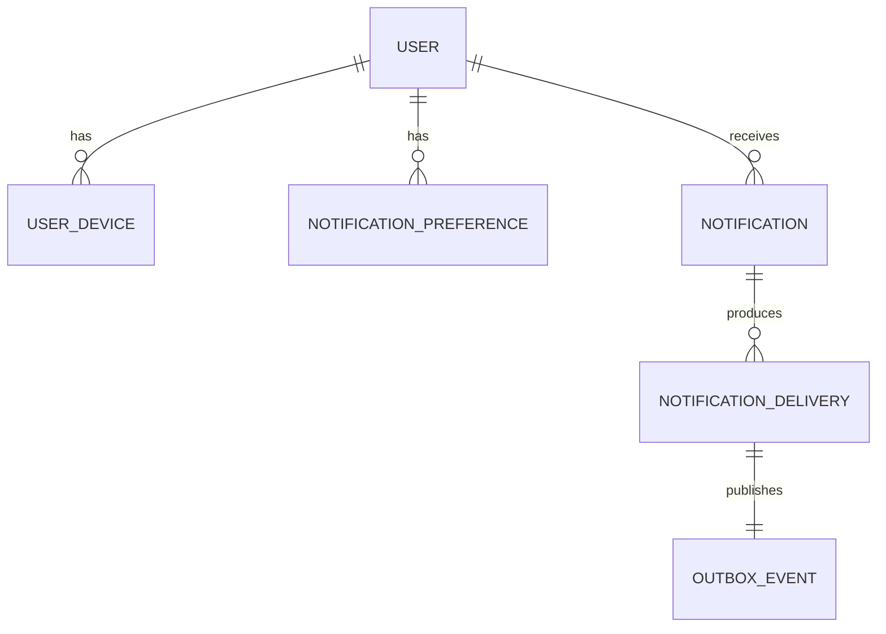

# 03. Architecture

## 1. 설계 목표

- Push, SMS, Email 알림을 하나의 시스템에서 처리한다.
- 외부 Provider의 지연과 장애가 API 서버로 전파되지 않도록 한다.
- 수락한 알림이 DB 저장과 메시지 발행 사이에서 유실되지 않도록 한다.
- 실패한 전송은 Retry하고 반복 실패는 DLQ로 격리한다.
- Event ID 기반 멱등성으로 중복 처리를 최소화한다.
- Redis 장애 시에도 핵심 알림 흐름은 유지한다.
- API와 Consumer를 수평 확장할 수 있도록 설계한다.

가장 중요한 비기능 요구사항은 **안정성, 확장성, 연성 실시간 처리**이다.

## 2. 전체 아키텍처

```mermaid
flowchart LR
    Client[Internal Service] --> API[Notification API]

    API --> Redis[(Redis)]
    API --> DB[(MySQL)]

    DB --> Outbox[Outbox Publisher]
    Outbox --> MQ[RabbitMQ]

    MQ --> PQ[Push Queue]
    MQ --> SQ[SMS Queue]
    MQ --> EQ[Email Queue]

    PQ --> PC[Push Consumer]
    SQ --> SC[SMS Consumer]
    EQ --> EC[Email Consumer]

    PC --> RL[Redis Rate Limiter]
    SC --> RL
    EC --> RL

    RL --> PP[Mock Push Provider]
    RL --> SP[Mock SMS Provider]
    RL --> EP[Mock Email Provider]
````

Notification API는 `Notification`, `NotificationDelivery`, `OutboxEvent`를 같은 DB Transaction에 저장한다.

Outbox Publisher가 `Pending` 이벤트를 RabbitMQ에 발행하고, Broker Confirm과 Return을 확인한 뒤 `PUBLISHED`로 변경한다.

## 3. 주요 컴포넌트

| 컴포넌트             | 역할                                                 |
|------------------|----------------------------------------------------|
| Notification API | 요청 검증, 멱등성 확인, 알림 접수                               | 
| MySQL            | 사용자, Preference, Notification, Delivery, Outbox 저장 |      
| Redis            | Preference Cache, Dedup Cache, Rate Limit          |   
| Outbox Publisher | PENDING OutboxEvent를 RabbitMQ에 발행                  |
| RabbitMQ         | 채널별 비동기 메시지 전달                                     | 
| Consumer         | Provider 호출 및 Delivery 상태 변경                       |
| Retry Queue      | 일시적 Provider 실패 재시도                                |
| DLQ              | 반복 실패 메시지 격리                                       |
| Mock Provider    | 외부 Provider 지연, 실패 재현                              |


## 4. 요청 흐름

### 알림 접수
```text
POST /api/v1/notifications
        ↓
Redis Dedup
        ↓
사용자 / Preference 조회
        ↓
DB Transaction
 ├─ Notification
 ├─ Delivery
 └─ OutboxEvent
        ↓
202 Accepted
```

동일 `eventId`는 Redis에서 빠르게 응답하고, Redis MISS 또는 장애 시 MySQL의 `event_id UNIQUE`를 최종 기준으로 사용한다.

### 메시지 발행과 전송
```text
Outbox PENDING
      ↓
RabbitMQ Publish
      ↓
채널별 Queue
      ↓
Consumer
      ↓
Rate Limit
      ↓
Provider
      ↓
Delivery / Notification 상태 갱신
```

하나의 Notification은 여러 Delivery를 만들 수 있다.

```text
Push Device 2개
SMS 1개
Email 1개
→ 총 4 Delivery
```

## 5. 실패 흐름

### Provider 실패
```text
Provider 실패
   ↓
Retry Queue
   ↓
재시도
   ↓
최대 3회 실패
   ↓
DLQ
   ↓
Delivery / Notification FAILED
```

### RabbitMQ 장애
```text
DB Commit
   ↓
Outbox PENDING
   ↓
Publish 실패
   ↓
RabbitMQ 복구
   ↓
재발행
```

Publish가 반복 실패하면 최대 5회 이후 Outbox와 Delivery를 `FAILED`로 전환한다.

### Redis 장애
| 기능 | 장애 시 처리 |
|-----| ----------|
| Preference Cache | MySQL Fallback |
| Dedup Cache | MySQL 조회 + `event_id UNIQUE` |
| Rate Limit | Fail-open |

Redis는 Source of Truth가 아니며, 정합성의 최종 기준은 MySQL이다.

## 6. 데이터 모델

### 주요 엔티티

| 엔티티  | 주요 필드                                                      | 설명        |
|------|------------------------------------------------------------|-----------|
| User | id, email, phoneNumber                                     | 사용자       |
| UserDevice | id, userId, platform, token                                | Push 단말   | 
| NotificationPreference | userId, channel, enabled                                   | 채널별 알림 설정 |
| Notification | id, eventId, userId, status                                | 논리적 알림    |
| NotificationDelivery | notificationId, channel, destination, status, attemptCount | 실제 전송     |
| OutboxEvent | notificationId, deliveryId, channel, status, attemptCount  | 메시지 발행 보장 |

### 관계



## 7. API 설계

| Method | Endpoint                                                  | 설명                     |
|-------|-----------------------------------------------------------|------------------------|
| POST  | /api/v1/notifications                                     | 알림 요청, Event ID 기반 멱등성 |
| PATCH | /api/v1/users/{userId}/notification-preferences/{channel} | 채널 알림 설정 변경            |

POST는 실제 Provider 전송 완료를 기다리지 않고 `202 Accepted`를 반환한다.

Preference 변경은 DB를 먼저 갱신한 뒤 Cache를 Evict한다.
```text
DB UPDATE + COMMIT
→ Redis Cache Evict
→ 다음 요청에서 최신 값 재캐싱
```

## 8. 핵심 설계 결정

### 1. RabbitMQ 비동기 처리
```text
API → Outbox → RabbitMQ → Consumer → Provider
```
Provider 지연과 장애를 API 요청 경로에서 분리하고 Queue를 Traffic Buffer로 사용한다.

### 2. Transactional Outbox

DB Commit과 RabbitMQ Publish는 하나의 Transaction이 아니므로 그 사이의 메시지 유실을 막기 위해 사용한다.

### 3. 채널별 Queue

Push, SMS, Email을 분리해 특정 Provider의 지연이나 장애가 다른 채널에 직접 영향을 주지 않도록 한다.

### 4. At-least-once + Idempotency

Exactly-once 대신 At-least-once를 기본으로 하고 Event ID와 Delivery 상태로 중복 가능성을 줄인다.

### 5. Redis는 보조 계층

Preference Cache, Dedup, Rate Limit에 사용하지만 Redis 장애가 알림 서비스 중단으로 이어지지 않도록 Fallback 또는 Fail-open을 적용한다.

## 9. 최종 설정

| 항목                         | 값 |
|----------------------------| ---|
| HikariCP Maximum Pool Size | 10 |
| Consumer Concurrency       | 5 |
| RabbitMQ Prefetch          | 50 |
| Push Rate Limit            | 100/s |
| SMS Rate Limit             | 20/s |
| Email Rate Limit           | 50/s |
| Preference Cache TTL       | 30분 |
| Redis Timeout              | 300ms |
| Outbox Publish Interval    | 1초 |

## 10. 운영 환경에서 추가할 사항

* API와 Worker 프로세스 분리 및 수평 확장
* MySQL Replica / Failover
* RabbitMQ Cluster
* Redis Sentinel 또는 Cluster
* Load Balancer
* 중앙 로그 및 Alerting
* Outbox / Delivery Retention 정책

## 11. 관측 지표

* API RPS / p95 / p99 / Error Rate
* HikariCP Active / Pending
* RabbitMQ Ready / Unacked / Ack Rate
* Consumer 처리량
* Retry / DLQ
* Redis Hit / Miss / Error
* Outbox PENDING / PUBLISHED / FAILED
* End-to-End Delivery Latency

비동기 구조에서는 **API RPS와 실제 Delivery 처리량**을 분리해서 해석한다.