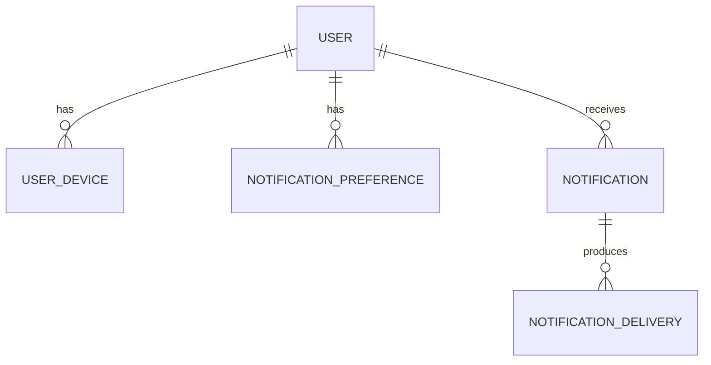

# 03. Architecture

## 1. 설계 목표

- Push, SMS, Email 알림을 하나의 시스템에서 처리한다.
- 외부 Provider의 지연과 장애가 API 서버로 전파되지 않도록 한다.
- 알림 요청을 유실하지 않고 실패한 전송을 재처리한다.
- 중복 요청 및 중복 전송을 최소화한다.
- API Server와 Worker를 수평 확장할 수 있도록 설계한다.

가장 중요한 비기능 요구사항은 **안정성, 확장성, 연성 실시간 처리**이다.

## 2. 전체 아키텍처

```mermaid
flowchart LR
    Client[Internal Service]
    API[Notification API]
    DB[(MySQL)]
    Redis[(Redis)]
    MQ[RabbitMQ]

    PushQ[Push Queue]
    SmsQ[SMS Queue]
    EmailQ[Email Queue]

    PushW[Push Worker]
    SmsW[SMS Worker]
    EmailW[Email Worker]

    APNS[Mock APNs]
    FCM[Mock FCM]
    SMS[Mock SMS Provider]
    EMAIL[Mock Email Provider]

    Client --> API

    API --> DB
    API --> Redis
    API --> MQ

    MQ --> PushQ
    MQ --> SmsQ
    MQ --> EmailQ

    PushQ --> PushW
    SmsQ --> SmsW
    EmailQ --> EmailW

    PushW --> APNS
    PushW --> FCM
    SmsW --> SMS
    EmailW --> EMAIL
````

실제 외부 서비스 대신 Mock Provider를 사용해 지연, 실패, Timeout을 재현한다.

## 3. 주요 컴포넌트

| 컴포넌트             | 역할                       | 확장 방법               |
|------------------|--------------------------|---------------------|
| Notification API | 요청 검증 및 알림 생성            | 수평 확장               | 
| MySQL            | 사용자, 설정, 알림 상태 저장        | Replica / Partition |       
| Redis            | 설정 캐시, Rate Limit, 중복 검사 | Scale-out           |       
| RabbitMQ         | 알림 요청 비동기 전달             | Queue / Consumer 확장 |       
| Worker           | 채널별 실제 전송 처리             | Consumer 수 증가       |
| Provider | APNs, FCM, SMS, Email 역할 | 외부 서비스 |

## 4. 요청 흐름

### 정상 흐름

1. 내부 서비스가 알림 API를 호출한다.
2. API 서버가 요청과 Event ID를 검증한다.
3. 사용자 정보와 알림 설정을 조회한다.
4. 알림 정보를 DB에 저장한다.
5. 채널별 메시지를 Queue에 전달한다.
6. Worker가 메시지를 가져온다.
7. 템플릿을 적용하고 외부 Provider로 전송한다.
8. 전송 결과를 DB에 기록한다.

### 실패 흐름

```text
Worker
  ↓
Provider 호출 실패
  ↓
Retry
  ↓
반복 실패
  ↓
DLQ
```

일시적 장애는 재시도하고 최대 재시도 횟수를 초과하면 DLQ로 이동한다.

## 5. 데이터 모델

### 주요 엔티티

| 엔티티  | 주요 필드                  | 설명      |
|------|------------------------|---------|
| User | id, email, phoneNumber | 사용자 연락처 |
| UserDevice | id, userId, platform, token | 사용자 단말 | 
| NotificationPreference | userId, channel, enalbed | 채널별 알림 설정 |
| NotificationTemplate | templateKey, channel, content | 알림 템플릿 |
| Notification | id, eventId, userId, status | 논리적 알림 |
| NotificationDelivery | noptificationId, channel, destination, status | 실제 전송 |
| OutboxEvent | eventId, payload, status | 메시지 유실 방지 |

### 관계



## 6. API 설계

| Method | Endpoint                   | 설명       | 멱등성         |
| ------ |----------------------------|----------|-------------|
| GET    | /api/v1/notifications/{id} | 알림 상태 조회 | Yes         |
| POST   | /api/v1/notifications      | 알림 전송 요청 | Event ID 기반 |
| PUT | /api/v1/users/{id}/preferences | 알림 설정 변경 | Yes |

## 7. 핵심 설계 결정

### 결정 1. 메시지 큐 기반 비동기 처리

#### 문제

외부 Provider 호출을 API 요청에서 직접 수행하면 Provider의 지연과 장애가 API 처리량에 영향을 준다.

#### 선택

RabbitMQ를 이용해 요청 수신과 실제 알림 전송을 분리한다.
```text
API → Queue → Worker → Provider
```

#### 트레이드오프

* 장점: 외부 장애 격리, Traffic Buffer, Worker 수평 확장
* 단점: 구조 복잡도 증가, 즉시 전송 결과 확인 불가

### 결정 2. 채널별 Queue와 Worker 분리
```text
Push Queue  → Push Worker
SMS Queue   → SMS Worker
Email Queue → Email Worker
```
SMS Provider가 느려져도 Push와 Email 처리에는 영향을 주지 않도록 한다.

### 결정 3. At-least-once + Idempotency
메시지 유실을 피하기 위해 At-least-once 전달을 기본으로 한다.

그 과정에서 발생할 수 있는 중복은 `eventId` 기반 멱등성 처리로 최소화한다.

완벽한 Exactly-once 전송은 외부 Provider까지 포함하면 보장하기 어렵다.

## 8. 데이터 정합성

* Notification 저장과 메시지 발행 사이의 유실 방지를 위해 Transactional Outbox를 사용한다.
* `eventId`에 Unique 제약을 두어 동일 요청을 방지한다.
* DB를 사용자 정보와 알림 설정의 Source of Truth로 사용한다.
* Redis는 캐시 및 부가 기능으로 사용한다.

## 9. 장애 대응

| 장애 상황       | 대응 방법                  |
|-------------|------------------------|
| API 서버 장애   | Stateless 구성 후 수평확장    |
| Provider 장애 | Retry + DLQ            |
| Worker 장애   | Queue 메시지 재처리          |
| Redis 장애    | DB 조회로 처리 가능하도록 구성     |
| RabbitMQ 장애 | 운영 환경에서는 Cluster 구성 고려 |

## 10. 단일 장애 지점

로컬 실험 환경에서는 MySQL, Redis, RabbitMQ를 각각 단일 인스턴스로 사용한다.

운영 환경에서는 다음 방법을 고려한다.

* MySQL Replica / Failover
* Redis Sentinel 또는 Cluster
* RabbitMQ Cluster
* 다중 Notification API / Worker

## 11. 관측 가능성

주요 지표:
* API RPS / p95 / p99
* Queue Depth
* Enqueue / Consume Rate
* Worker 처리량
* Retry Rate
* DLQ 메시지 수
* Provider Latency / Error Rate
* End-to-End Delivery Latency
