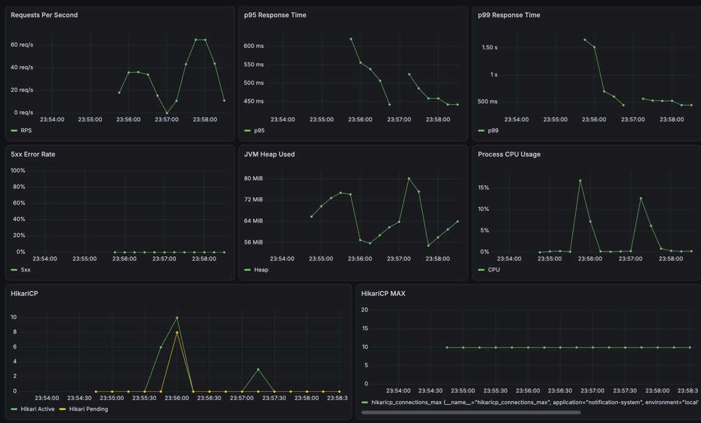

# 04. Experiment

## 1. 실험 목적

이번 실험을 통해 확인하려는 내용을 작성한다.

## 2. 가설

> 적용하려는 개선이 어떤 지표에 어떤 영향을 줄 것으로 예상하는지 작성한다.

예시:

> Redis 캐시를 적용하면 반복 DB 조회가 감소해 p95 응답 시간과 DB 부하가 줄어들 것이다.

## 3. 비교 대상

| 구분 | Baseline | Experiment |
|---|---|---|
| 구조 | 변경 전 구조 | 변경 후 구조 |
| 설정 |  |  |
| 기술 |  |  |

## 4. 통제 변수

두 실험에서 동일하게 유지할 조건을 작성한다.

- 테스트 데이터:
- 애플리케이션 인스턴스 수:
- JVM 옵션:
- CPU 및 메모리:
- DB Connection Pool:
- k6 시나리오:
- 테스트 시간:
- Warm-up 시간:

## 5. 실험 환경

| 항목 | 값 |
|---|---|
| CPU |  |
| Memory |  |
| OS |  |
| Java | 25 |
| Spring Boot |  |
| Database |  |
| Redis |  |
| k6 |  |
| Prometheus |  |
| Grafana |  |

## 6. 부하 테스트 시나리오

### Smoke Test

- 목적:
- VU:
- 실행 시간:
- Threshold:

### Load Test

- 목적:
- VU 변화:
- 실행 시간:
- Threshold:

### Stress Test

- 목적:
- VU 변화:
- 종료 조건:

## 7. 측정 지표

### 클라이언트 관점

- k6 RPS
- k6 p95
- k6 p99
- 실패율
- Check 성공률

### 서버 관점

- Spring Boot RPS
- 서버 처리 시간
- CPU
- JVM Heap
- GC
- 활성 스레드 수
- DB Connection Pool
- 캐시 Hit Ratio
- 메시지 Queue Lag

## 8. Warm-up

- Warm-up 실행 여부: 별도의 명시적 Warm-up 미적용
- 측정에서 제외한 구간: 없음
- 영향:
  - 첫 번째 부하 테스트 구간에서 HikariCP Pending과 p99가 일시적으로 증가했다.
  - 이후 테스트에서는 JVM, DB Connection Pool 등이 Warm-up된 상태였을 가능성이 있다.
- 후속 실험:
  - 동일 조건 비교 시 사전 Warm-up을 수행하고 측정 구간에서 제외한다.

## 9. Baseline 결과

### 동기식 Baseline

Mock Provider는 Delivery당 100ms의 지연을 발생시키며,   
Provider 호출을 Notification API의 DB Transaction 내부에서 순차적으로 수행했다.

| VU | RPS | Avg | p95 | p99 | Error Rate |
|---:|---:|---:|---:|---:|---:|
| 10 | 17.32 | 576ms | 892ms | - | 0% |
| 30 | 22.09 | 1.33s | 2.13s | 2.57s | 0% |
| 50 | 23.55 | 2.06s | 3.80s | 3.83s | 0% |

30 VU 이상에서 HikariCP Active Connection이 최댓값인 10에 도달했다.
30 VU에서는 약 20개, 50 VU에서는 약 40개의 요청이 Connection을 대기했다.

동시 요청을 증가시켜도 처리량은 크게 증가하지 않았으며,    
Connection 대기로 인해 응답 시간이 급격히 증가했다.

원인은 DB Transaction 내부에서 외부 Provider를 동기 호출하여 외부 I/O 대기 시간 동안 DB Connection을 점유한 구조로 판단했다.


## 10. 개선 내용

### Experiment 1. Transaction Boundary 분리

Baseline에서는 `NotificationService.send()` 전체를 하나의 DB Transaction으로 처리했다.

```text
Transaction 시작
    ↓
Notification / Delivery 저장
    ↓
Mock Provider 순차 호출
    ↓
Delivery 상태 변경
    ↓
Transaction Commit
```

Mock Provider는 Delivery당 100ms의 지연을 발생시키며,   
테스트 사용자는 Push Device 2개, SMS 1개, Email 1개로 총 4번의 Provider 호출이 발생한다.

따라서 하나의 요청에서 최소 약 400ms 동안 외부 I/O가 발생했으며,   
이 시간 동안 DB Transaction과 Connection도 유지되었다.

Baseline 부하 테스트에서 HikariCP Connection Pool 최대 크기인 10에 도달했고,   
30 VU에서는 약 20개, 50 VU에서는 약 40개의 Connection 대기가 발생했다.

외부 I/O 대기 시간 동안 DB Connection을 점유하지 않도록   
Transaction Boundary를 다음과 같이 분리했다.

```text
Transaction 1
- User / Preference / Device 조회
- Notification / Delivery 저장
- Commit
- DB Connection 반환

        ↓

Transaction 없음
- Mock Provider 순차 호출

        ↓

Transaction 2
- Delivery 결과 저장
- Notification 상태 변경
- Commit
```

Provider 호출 방식과 지연 시간은 변경하지 않고,   
DB Transaction의 범위만 변경하여 Connection 점유가 성능에 미치는 영향을 비교했다.

## 11. 개선 후 결과

### Experiment 1. Transaction Boundary 분리 결과

| VU | 지표 | Baseline | Experiment | 변화 |
|---:|---|---:|---:|---:|
| 30 | RPS | 22.09 | 65.88 | 2.98배 |
| 30 | Avg | 1.33s | 454.66ms | 65.8% 감소 |
| 30 | p95 | 2.13s | 560.98ms | 73.7% 감소 |
| 30 | p99 | 2.57s | 1.47s | 42.8% 감소 |
| 30 | Error Rate | 0% | 0% | 동일 |
| 50 | RPS | 23.55 | 117.74 | 5.00배 |
| 50 | Avg | 2.06s | 421.79ms | 79.5% 감소 |
| 50 | p95 | 3.80s | 456.86ms | 88.0% 감소 |
| 50 | p99 | 3.83s | 515.22ms | 86.5% 감소 |
| 50 | Error Rate | 0% | 0% | 동일 |

Baseline에서는 동시 요청 증가에 따라 HikariCP Active Connection이   
최댓값인 10에 지속적으로 도달했고 Connection Pending이 증가했다.

Transaction Boundary 분리 후에는 Provider 호출 중 DB Connection을 반환하면서   
Connection Pool의 지속적인 포화가 사라졌다.



## 12. 결과 분석

### 12.1 DB Connection Pool 병목 확인

Baseline에서는 VU를 30에서 50으로 증가시켜도 RPS가   
22.09에서 23.55로 약 6.6% 증가하는 데 그쳤다.

반면 p95는 2.13초에서 3.80초로 증가하여,   
동시 요청 증가가 처리량 증가보다 대기 시간 증가로 이어졌다.   

HikariCP의 최대 Connection 수는 10이었으며,   
Provider 호출을 포함한 Transaction이 약 400ms 이상 Connection을 점유했다.

따라서 이론적인 처리량 한계는 대략 다음과 같이 예상할 수 있다.

```text
10 Connections / 약 0.42초
≈ 23.8 RPS
```

실제 50 VU Baseline의 처리량은 23.55 RPS로,   
Connection Pool에 의해 처리량이 제한되었다는 분석과 유사한 결과를 보였다.

### 12.2 Transaction Boundary 분리 효과

외부 Provider 호출을 DB Transaction 밖으로 분리한 후   
50 VU에서 RPS는 23.55에서 117.74로 약 5배 증가했다.

p95 역시 3.80초에서 456.86ms로 약 88% 감소했다.

Provider 호출 중에는 DB Connection을 점유하지 않으므로,   
동시 요청이 증가하더라도 Connection Pool 대기가 지속적으로 발생하지 않았다.

50 VU에서 평균 응답 시간이 약 422ms였으므로 다음과 같이 예상할 수 있다.

```text
50 VU / 약 0.422초
≈ 118 RPS
```
실제 처리량인 117.74 RPS와 유사핟.

이를 통해 Transcation Boundary 분리 이후에는 DB Connection Pool보다   
동기식 Provider 호출 시간이 처리량과 응답 시간에 더 직접적인 영향을 주는 것으로 판단했다.

### 12.3 남아 있는 병목

DB Connection Pool 병목은 완화되었지만,   
Notification API는 여전히 모든 Provider 호출이 끝날 때까지 HTTP 응답을 반환하지 않는다.

현재 한 요청은 총 4번의 Mock Provider를 순차적으로 호출하므로   
최소 약 400ms의 응답 시간이 발생한다.

따라서 다음 실험에서는 RabbitMQ를 이용하여   
Provider 호출을 HTTP 요청 처리 경로에서 분리하고,   
API가 알림 요청을 Queue에 등록한 뒤 즉시 응답하도록 비동기 구조로 변경한다.

## 13. Platform Thread와 Virtual Thread 비교

실제 블로킹 I/O가 존재하는 경우 반드시 수행한다.

### 실험 A

```text
Java 25 + Platform Thread
VIRTUAL_THREADS_ENABLED=false
````

### 실험 B

```text
Java 25 + Virtual Thread
VIRTUAL_THREADS_ENABLED=true
```

### 비교 지표

| 지표         | Platform Thread | Virtual Thread | 분석 |
| ---------- | --------------: | -------------: | -- |
| RPS        |                 |                |    |
| p95        |                 |                |    |
| p99        |                 |                |    |
| CPU        |                 |                |    |
| Heap       |                 |                |    |
| 활성 스레드     |                 |                |    |
| DB Pool 대기 |                 |                |    |
| 오류율        |                 |                |    |

### 결론

* 가상 스레드가 효과적이었던 구간:
* 효과가 제한된 이유:
* 외부 시스템의 병목:
* 최종 선택:

## 14. 실험 한계

* 로컬 환경과 운영 환경의 차이:
* 데이터 크기의 한계:
* 테스트 시간의 한계:
* 네트워크 조건의 한계:
* 재현에 영향을 줄 수 있는 요소:

## 15. 후속 실험

* [ ] 추가로 확인할 가설
* [ ] 더 높은 부하에서의 테스트
* [ ] 장애 상황 테스트
* [ ] 다른 설계 대안 비교