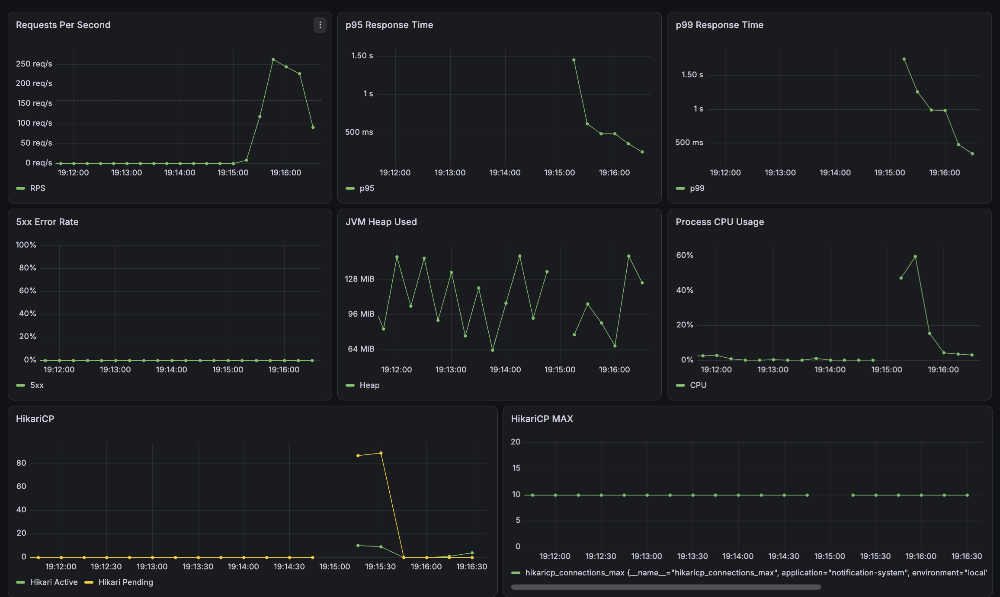
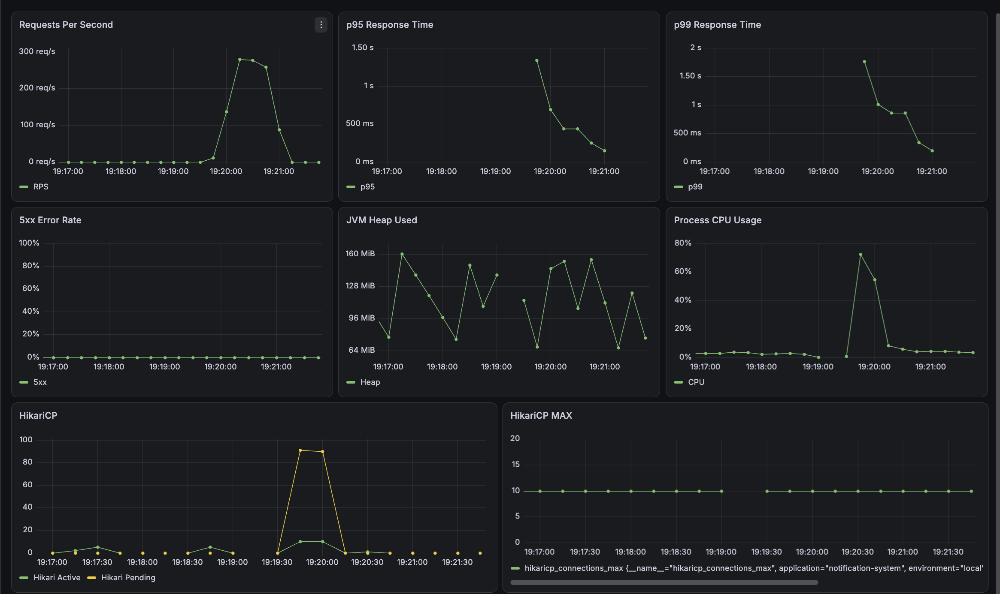
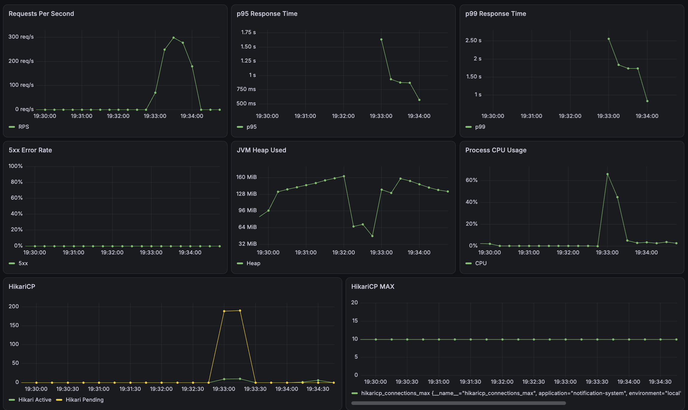
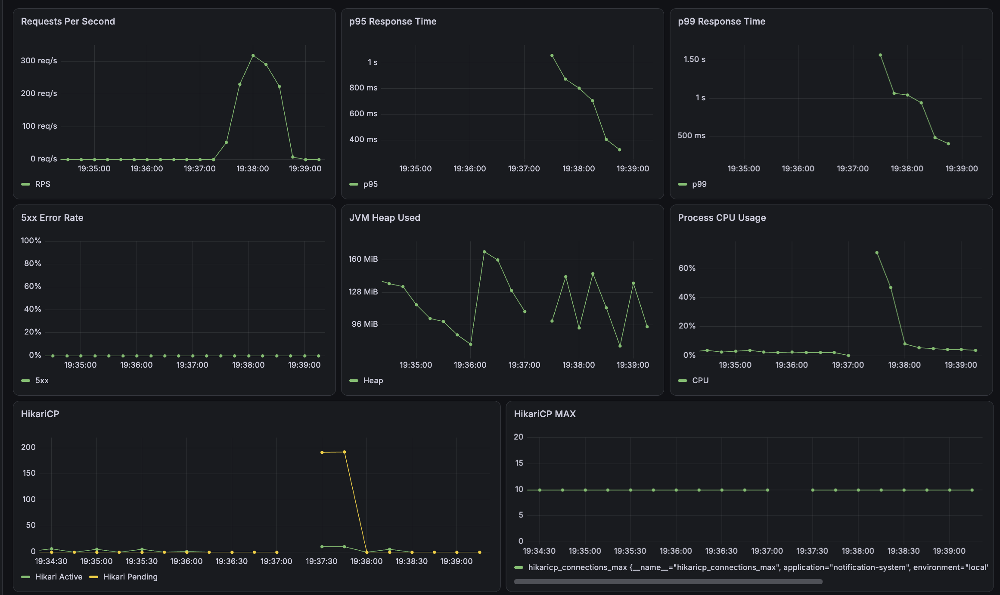

# 04. Experiment

## 1. 실험 목적

동기식 Notification API를 Baseline으로 두고 부하 증가 시 병목을 확인한 뒤,   
다음 순서로 구조를 개선했다.

```text
동기 Provider 호출
→ Transaction Boundary 분리
→ RabbitMQ 비동기화
→ Consumer 튜닝
→ Redis Cache / Dedup / Rate Limit
→ Retry / DLQ / Transactional Outbox
→ Virtual Thread 비교
```

목표는 특정 기술의 성능을 보여주는 것보다   
한 병목을 제거했을 때 다음 병목이 어디로 이동하는지 확인하는 것이었다.

## 2. 실험 환경

| 항목 | 값 |
|---- | ---|
| Java | 25 |
| Spring Boot | 4.1 |
| MySQL | 8.4 |
| Redis | 7.4 |
| RabbitMQ | 4 |
| k6 | 2.1 |
| Prometheus | 3.13 |
| Grafana | 13.1 |
| HikariCP Max Pool | 10 |
| Mock Provider Latency | Delivery 당 약 100ms |

테스트 사용자는 Push Device 2개, SMS 1개, Email 1개로 최대 4개의 Delivery를 생성한다. 

비동기화 이후의 RPS는 API 접수 처리량이며 실제 Provider까지 완료된 Delivery 처리량과는 다르다.

## 3. Baseline: 동기식 Provider 호출

초기 구조는 Provider 호출을 DB Transaction 내부에서 수행했다.
```text
DB Transaction
→ Notification / Delivery 저장
→ Provider 4회 호출
→ 상태 갱신
→ Commit
```

| VU | RPS | Avg | p95 | p99 | Error | 
| -- | --- | --- | --- | --- |-------|
| 10 | 17.32 | 576ms | 892ms | - | 0%    |
| 30 | 22.09 | 1.33s | 2.13s | 2.57s | 0%    |
| 50 | 23.55 | 2.06s | 3.80s | 3.83s | 0% |

30 VU 이상에서 HikariCP Active가 10에 도달했고,   
Connection Pending은 30 VU에서 약 20, 50 VU에서 약 40이었다.

```text
10 Connections / 약 0.42s
≈ 23.8 RPS
```

실제 50 VU의 23.55 RPS와 유사해 첫 병목을 DB Connection Pool로 판단했다.


## 4. Experiment 1: Transaction Boundary 분리

Provider I/O 중 DB Connection을 반환하도록 Transaction을 분리했다.
```text
Transaction 1: DB 저장
→ Provider 호출
→ Transaction 2: 상태 갱신
```

| VU | 지표 | Baseline | Baseline 분리 | 변화 |
| -- | --- | -------- | ----- | ---- |
| 30 | RPS | 22.09 | 65.88 | 2.98배 |
| 30 | p95 | 2.13s | 560.98ms | 73.7% 감소 | 
| 50 | RPS | 23.55 | 117.74 | 5.00배 | 
| 50 | p95 | 3.80s | 456.86ms | 88.0% 감소 |

Provider 호출 중 Connection을 점유하지 않게 되면서 HikariCP의 지속적인 포화가 사라졌다.   
다만 HTTP 요청은 여전히 약 400ms의 Provider 호출을 기다렸다.


## 5. Experiment 2: RabbitMQ 비동기화

Provider 호출을 HTTP 요청 경로에서 제거했다.

```text
HTTP Request
→ DB 저장
→ RabbitMQ
→ 202 Accepted

Queue
→ Consumer
→ Provider
```

| VU | 지표 | Baseline 분리 | RabbitMQ | 변화       |
| -- | --- |-------------|----------|----------|
| 30 | RPS | 65.88       | 496.78   | 7.54배    |
| 30 | p95 | 560.98ms    | 168.54ms | 70.0% 감소 | 
| 50 | RPS | 117.74       | 511.23   | 4.34배    | 
| 50 | p95 | 456.86ms       | 266.21ms | 41.7% 감소 |

50 VU 기준 최초 Baseline 23.55 RPS에서 511.23 RPS로 API 접수 처리량은 약 21.7배 증가했다.   
하지만 Queue Backlog가 새 병목으로 나타났다.

| VU | Total Ready | Unacked | 
| --- | ----------- | ------- |
| 30 | 55,643 | 750 |
| 50 | 57,514 | 750 |

즉 병목이 **API 요청 경로에서 Consumer 처리량**으로 이동했다.


## 6. Experiment 3: Consumer 튜닝

### 6.1 Concurrency

Prefetch 250, 30 VU에서 비교했다.

| Concurrency | API RPS | p95 | Queue당 Ack Rate | Total Backlog | 
|-------------| ------- | --- | --------------- | -------------- |
| 1           | 463.69 | 185.95ms | 약 9 msg/s | 54,615 |
| 5           | 338.21 | 227.94ms | 약 44 msg/s | 36,168 |
| 10 | 289.62 | 307.02ms | 약 89 msg/s | 15,645 |

Concurrency 증가에 따라 Ack Rate는 거의 선형적으로 증가했다.

하지만 Concurrency 10에서는 CPU가 약 100%까지 증가하고 HikariCP Pending도 커졌다.

API Consumer가 같은 Application과 DB Pool을 공유하기 때문에   
처리량과 자원 경합의 균형을 고려해 Concurrency 5를 선택했다.

### 6.2 Prefetch

Concurrency 5, 50 VU에서 비교했다.

| Prefetch | API RPS | p95      | Queue당 Ack Rate | Queue당 Unacked | 
|----------|---------|----------|-----------------|----------------|
| 10       | 289.49  | 473.10ms | 약 45 msg/s      | 50             |
| 50       | 445.85  | 276.84ms | 약 45 msg/s      | 250            |
| 250      | 508.60  | 256.38ms | 약 44~45 msg/s   | 1250           |

Prefetch를 높여도 실제 Ack Rate는 거의 변하지 않았따.

Prefetch 250은 Prefetch 50 대비 처리량 향상 없이 Unacked만 5배 증가해   
최종값을 50으로 정했다.

## 7. Experiment 4: Redis

### 7.1 Preference Cache

사용자의 활성 Channel을 요청마다 MySQL에서 조회하던 구조를 Cache-Aside로 변경했다.
```text
Redis HIT → Cache 사용
Redis MISS → MySQL 조회 → Redis 저장
```

Preference 변경 시에는 DB를 먼저 수정하고 Cache를 Evict한다.

30 VU, 30초, 동일 사용자 + 매 요청 새로운 `eventId` 조건이다.

|  지표   | DB 조회    | Redis Cache | 변화       |
|-------|----------|-------------|----------|
| RPS   | 180.51   | 513.69      | 2.85배    |
| Avg   | 164.96ms | 58.02ms     | 64.8% 감소 | 
| p95   | 455.88ms | 129.45ms    | 71.6% 감소 | 
| Error | 0%       | 0%          | 동일       |

Notification, Delivery, Outbox INSERT는 그대로 발생하므로   
이 결과는 반복 Preference SELECT 제거 효과로 해석했다.

### 7.2 Dedup Response Cache

동일 `eventId` 반복 요청은 Redis에 저장된 기존 응답을 반환한다.

최종 정합성은 MySQL의 `event_id UNIQUE`가 담당한다.

|  지표   | 미사용      | Redis Dedup | 변화       |
|-------|----------|-------------|----------|
| RPS   | 1,044.11 | 3,957.98    | 3.79배    |
| Avg   | 28.50ms  | 7.42ms      | 74.0% 감소 | 
| p95   | 93.51ms  | 18.27ms     | 80.5% 감소 | 
| Error | 0%       | 0%          | 동일       |

이 값은 전체 API 처리량이 아니라 **동일 Event ID 중복 요청 시나리오**의 결과다.

Cache에는 최초 접수 응답이 저장되므로 중복 POST에서는 이후 DB 상태가 `COMPLETED`여도 `PROCESSING`이 반환될 수 있다.

### 7.3 Rate Limit

Consumer와 Provider 사이에 Redis Fixed Window Rate Limit을 적용했다.

| Channel | Limit |
| ------- |-------|
| Push | 100/s |
| SMS | 20/s  |
| Email | 50/s  |

* Limit 초과 → Throttle Queue
* Provider 실패 → Retry Queue
* Redis 장애 → Fail-open

Rate Limit은 성능 향상보다 Provider 보호를 위한 안정성 기능으로 사용했다.

## 8. 안정성 검증

| 항목 | 조건 | 결과 |
| --- | --- | --- |
| Retry | 첫 Provider 호출 실패 | 재시도 후 `SENT`, `attemptCount=2` |
| DLQ | Provider 지속 실패 | 3회 후 `FAILED`, DLQ 이동 |
| Outbox | RabbitMQ 중단 | `PENDING` 보존 후 복구 시 재발행 |
| Dedup | 동일 eventId 반복 | Notification 1건 유지 |
| Redis 장애 | Redis 중단 | Preference/Dedup DB Fallback, Rate Limit Fail-open |

### Transactional Outbox

Notification, Delivery, Outbox를 하나의 DB Transaction으로 저장한다.

```text
DB Commit
→ Outbox PENDING
→ RabbitMQ Publish
→ 성공: PUBLISHED
→ 실패: 재시도
```

Publisher Confirm과 Return으로 Broker 수신 및 라우팅 실패를 확인한다.   
Publish가 최대 5회 실패하면 Outbox와 Delivery를 `FAILED`로 전환한다.

### Redis 장애

Redis Timeout은 300ms로 설정했다.

Redis가 중단되어도 Notification API는 DB Fallback 또는 Fail-open으로 계속 처리하고,    
복구 후 다음 Cache MISS에서 Preference Cache가 다시 생성되는 것을 확인했다.

## 9. Experiment 5: Platform Thread vs Virtual Thread

공통 조건:
* Consumer Concurrency 5
* Prefetch 50
* HikariCP Max 10
* 30초
* 매 요청 새로운 `eventId`

### 100 VU
| 지표 | Platform 평균 | Virtual | 변화 |
| --- | ------------ | ------- | --- |
| RPS | 486.91 | 544.44 | 11.8% 증가 |
| Avg | 204.63ms | 182.98ms | 10.6% 감소 |
| p95 | 530.48ms | 447.01ms | 15.7% 감소 |
| p99 | 1.04s | 876.14ms | 15.8% 감소 |

### 200 VU
| 지표 | Platform 평균 | Virtual  | 변화       |
| --- |-------------|----------|----------|
| RPS | 542.68      | 579.90   | 6.9% 증가  |
| Avg | 366.23ms    | 343.40ms | 6.2% 감소  |
| p95 | 874.41ms    | 812.74ms | 7.1% 감소  |
| p99 | 1.69s       | 1.06s    | 37.3% 감소 |

Virtual Thread에서 일부 개선이 있었지만,   
100 VU에서는 약 90개, 200 VU에서는 약 190개의 HikariCP Pending이 관찰됐다.

```text
200 VU
약 10개  → DB Connection 사용
약 190개 → Connection 대기
```

Virtual Thread는 Blocking 대기 비용은 줄이지만 DB Connection 수를 늘리지는 않는다.

VU를 100에서 200으로 두 배 올려도 Virtual Thread RPS는 약 6.5%만 증가한 반면 p95는 크게 증가했다.

따라서 높은 부하에서는 **Thread보다 DB Connection Pool이 먼저 처리량을 제한**한다고 판단했다.

<p>100 VU Platform Thread</p>


<p>100 VU Virtual Thread</p>


<p>200 VU Platform Thread</p>


<p>200 VU Virtual Thread</p>


## 10. 최종 설정

| 항목 | 값 |
| --- | -- |
| Consumer Concurrency | 5 |
| RabbitMQ Prefetch | 50 |
| Push Rate Limit | 100/s |
| SMS Rate Limit | 20/s |
| Email Rate Limit | 50/s |
| Redis Timeout | 300ms | 
| Outbox Publish Interval | 1초 |


## 11. 병목 이동 요약
```text
동기식 Baseline
→  DB Connection Pool

Transaction Boundary 분리
→  Provider 동기 호출

RabbitMQ 비동기화
→ Consumer / Queue Backlog

Consumer 병렬도 증가
→ CPU / DB Pool 자원 경합

Redis Cache
→ 반복 DB 조회 감소

Virtual Thread
→ Blocking 대기 비용 감소
→ 높은 부하에서는 DB Pool이 다시 지배적 병목
```

## 12. 실험 한계
* 로컬 Docker 환경에서 측정했다.
* API와 Consumer가 같은 Process와 DB Pool을 공유한다.
* 실제 Provider가 아닌 Mock Provider를 사용했다.
* 일부 실험은 반복 횟수가 충분하지 않았다.
* API RPS는 End-to-End Delivery 처리량과 동일하지 않다.
* MySQL, Redis, RabbitMQ는 단일 인스턴스다.

운영 환경에서는 API와 Worker를 분리하고 독립적으로 수평 확장한 뒤 다시 검증할 필요가 있다.