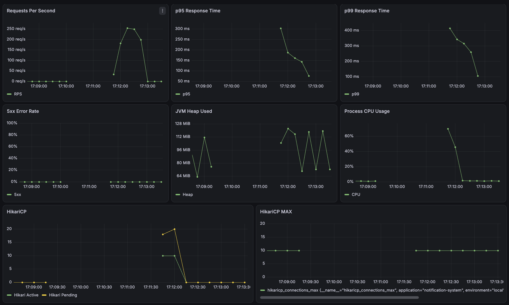
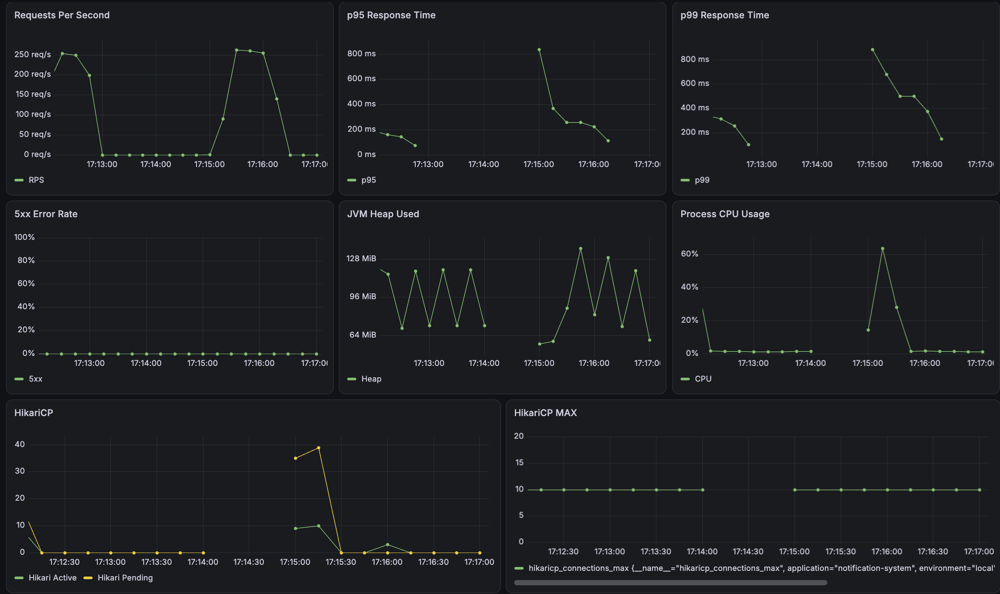
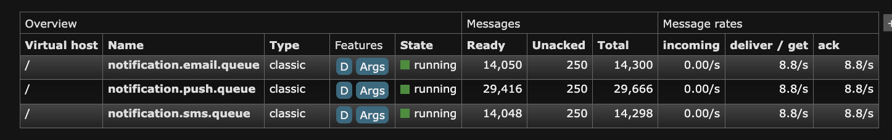
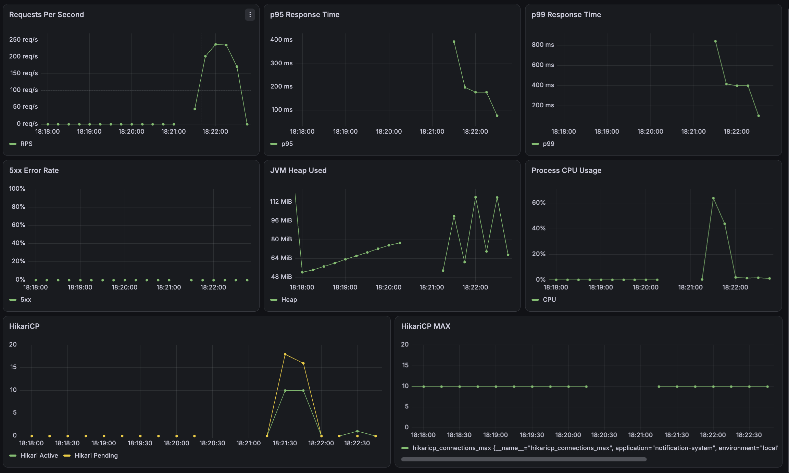
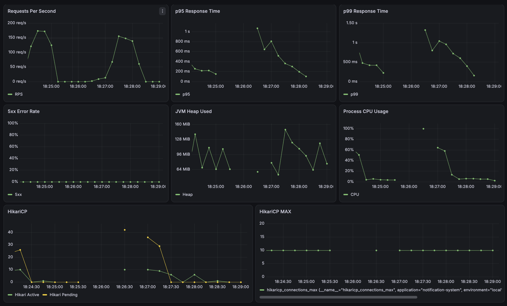
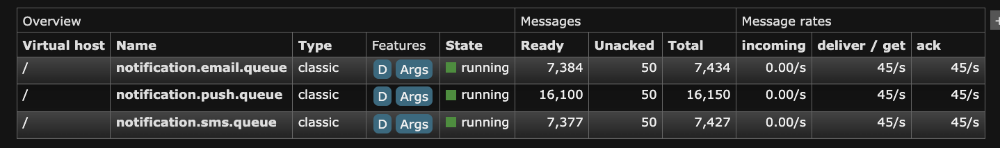
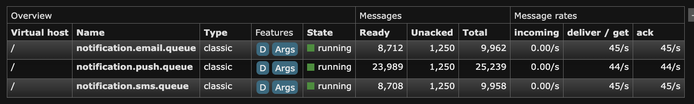

# 04. Experiment

## 1. 실험 목적

이번 실험을 통해 확인하려는 내용을 작성한다.

## 2. 가설

> 적용하려는 개선이 어떤 지표에 어떤 영향을 줄 것으로 예상하는지 작성한다.

예시:

> Redis 캐시를 적용하면 반복 DB 조회가 감소해 p95 응답 시간과 DB 부하가 줄어들 것이다.

## 3. 비교 대상

| 구분 | Baseline | Experiment |
|---|---|---|
| 구조 | 변경 전 구조 | 변경 후 구조 |
| 설정 |  |  |
| 기술 |  |  |

## 4. 통제 변수

두 실험에서 동일하게 유지할 조건을 작성한다.

- 테스트 데이터:
- 애플리케이션 인스턴스 수:
- JVM 옵션:
- CPU 및 메모리:
- DB Connection Pool:
- k6 시나리오:
- 테스트 시간:
- Warm-up 시간:

## 5. 실험 환경

| 항목 | 값 |
|---|---|
| CPU |  |
| Memory |  |
| OS |  |
| Java | 25 |
| Spring Boot |  |
| Database |  |
| Redis |  |
| k6 |  |
| Prometheus |  |
| Grafana |  |

## 6. 부하 테스트 시나리오

### Smoke Test

- 목적:
- VU:
- 실행 시간:
- Threshold:

### Load Test

- 목적:
- VU 변화:
- 실행 시간:
- Threshold:

### Stress Test

- 목적:
- VU 변화:
- 종료 조건:

## 7. 측정 지표

### 클라이언트 관점

- k6 RPS
- k6 p95
- k6 p99
- 실패율
- Check 성공률

### 서버 관점

- Spring Boot RPS
- 서버 처리 시간
- CPU
- JVM Heap
- GC
- 활성 스레드 수
- DB Connection Pool
- 캐시 Hit Ratio
- 메시지 Queue Lag

## 8. Warm-up

- Warm-up 실행 여부: 별도의 명시적 Warm-up 미적용
- 측정에서 제외한 구간: 없음
- 영향:
  - 첫 번째 부하 테스트 구간에서 HikariCP Pending과 p99가 일시적으로 증가했다.
  - 이후 테스트에서는 JVM, DB Connection Pool 등이 Warm-up된 상태였을 가능성이 있다.
- 후속 실험:
  - 동일 조건 비교 시 사전 Warm-up을 수행하고 측정 구간에서 제외한다.

## 9. Baseline 결과

### 동기식 Baseline

Mock Provider는 Delivery당 100ms의 지연을 발생시키며,   
Provider 호출을 Notification API의 DB Transaction 내부에서 순차적으로 수행했다.

| VU | RPS | Avg | p95 | p99 | Error Rate |
|---:|---:|---:|---:|---:|---:|
| 10 | 17.32 | 576ms | 892ms | - | 0% |
| 30 | 22.09 | 1.33s | 2.13s | 2.57s | 0% |
| 50 | 23.55 | 2.06s | 3.80s | 3.83s | 0% |

30 VU 이상에서 HikariCP Active Connection이 최댓값인 10에 도달했다.
30 VU에서는 약 20개, 50 VU에서는 약 40개의 요청이 Connection을 대기했다.

동시 요청을 증가시켜도 처리량은 크게 증가하지 않았으며,    
Connection 대기로 인해 응답 시간이 급격히 증가했다.

원인은 DB Transaction 내부에서 외부 Provider를 동기 호출하여 외부 I/O 대기 시간 동안 DB Connection을 점유한 구조로 판단했다.


## 10. 개선 내용

### Experiment 1. Transaction Boundary 분리

Baseline에서는 `NotificationService.send()` 전체를 하나의 DB Transaction으로 처리했다.

```text
Transaction 시작
    ↓
Notification / Delivery 저장
    ↓
Mock Provider 순차 호출
    ↓
Delivery 상태 변경
    ↓
Transaction Commit
```

Mock Provider는 Delivery당 100ms의 지연을 발생시키며,   
테스트 사용자는 Push Device 2개, SMS 1개, Email 1개로 총 4번의 Provider 호출이 발생한다.

따라서 하나의 요청에서 최소 약 400ms 동안 외부 I/O가 발생했으며,   
이 시간 동안 DB Transaction과 Connection도 유지되었다.

Baseline 부하 테스트에서 HikariCP Connection Pool 최대 크기인 10에 도달했고,   
30 VU에서는 약 20개, 50 VU에서는 약 40개의 Connection 대기가 발생했다.

외부 I/O 대기 시간 동안 DB Connection을 점유하지 않도록   
Transaction Boundary를 다음과 같이 분리했다.

```text
Transaction 1
- User / Preference / Device 조회
- Notification / Delivery 저장
- Commit
- DB Connection 반환

        ↓

Transaction 없음
- Mock Provider 순차 호출

        ↓

Transaction 2
- Delivery 결과 저장
- Notification 상태 변경
- Commit
```

Provider 호출 방식과 지연 시간은 변경하지 않고,   
DB Transaction의 범위만 변경하여 Connection 점유가 성능에 미치는 영향을 비교했다.

### Experiment 2. RabbitMQ 비동기 처리

Transaction Boundary 분리 후 DB Connection Pool 병목은 완화되었지만,   
Notification API는 여전히 Mock Provider 호출이 완료될 때까지 응답을 반환하지 않았다.

한 요청은 Push 2건, SMS 1건, Email 1건으로 총 4번의 Provider 호출을 수행하며,   
각 Provider에 100ms의 지연이 존재하므로 최소 약 400ms의 응답 시간이 발생했다.

Provider 호출을 HTTP 요청 처리 경로에서 제거하기 위해 RabbitMQ를 도입했다.

```text
기존

HTTP Request
    ↓
DB 저장
    ↓
Provider 호출
    ↓
DB 상태 변경
    ↓
HTTP Response
```
```text
RabbitMQ 적용 후

HTTP Request
    ↓
DB 저장
    ↓
RabbitMQ Publish
    ↓
202 Accepted

---------------------

RabbitMQ Queue
    ↓
Consumer
    ↓
Mock Provider
    ↓
Delivery 상태 변경
```

Push, SMS, Email은 서로 다른 외부 Provider의 장애와 처리량에 독립적으로 대응할 수 있도록 채널별 Queue로 분리하였다.
* `notification.push.queue`
* `notification.sms.queue`
* `notification.email.queue`

API는 실제 알림 전송 완료를 기다리지 않고 요청 접수 후 `202 Accepted`를 반환한다.

### Experiment 3. Consumer Concurrency와 Prefetch 튜닝

RabbitMQ 비동기화 이후 API의 응답 성능은 크게 개선되었지만,   
Producer의 메시지 발행 속도가 Consumer 처리 속도를 초과하면서 Queue Backlog가 지속적으로 증가했다.

초기 Consumer는 채널별로 1개씩 동작했으며,   
Mock Provider가 Delivery당 100ms의 지연을 발생시키므로   
Consumer 하나의 이론적인 최대 처리량은 약 10 msg/s이다.
```text
1 Consumer / 0.1초
≈ 10 msg/s
```

실제 측정에서도 각 Queue의 각 Ack Rate는 약 9 msg/s로 확인되었다.

이에 Consumer 수를 증가시켜 병렬 처리량을 개선할 수 있는지 확인하기 위해   
Consumer Concurrency를 1, 5, 10으로 변경하여 비교했다.
```text
concurrency = 1
Queue → Consumer 1개

concurrency = 5
Queue → Consumer 5개

concurrency = 10
Queue → Consumer 10개
```

이후 Consumer가 ACK 이전에 미리 전달받을 수 있는 메시지 수인 Prefetch를   
10, 50, 250으로 변경하여 실제 처리량과 Unacked 메시지 수를 비교했다.

Concurrency 실험에서는 Prefetch를 250으로 고정하고 30 VU로 측정했으며,   
Prefetch 실험에서는 Concurrency를 5로 고정하고 50 VU로 측정했다.

## 11. 개선 후 결과

### Experiment 1. Transaction Boundary 분리 결과

| VU | 지표 | Baseline | Experiment | 변화 |
|---:|---|---:|---:|---:|
| 30 | RPS | 22.09 | 65.88 | 2.98배 |
| 30 | Avg | 1.33s | 454.66ms | 65.8% 감소 |
| 30 | p95 | 2.13s | 560.98ms | 73.7% 감소 |
| 30 | p99 | 2.57s | 1.47s | 42.8% 감소 |
| 30 | Error Rate | 0% | 0% | 동일 |
| 50 | RPS | 23.55 | 117.74 | 5.00배 |
| 50 | Avg | 2.06s | 421.79ms | 79.5% 감소 |
| 50 | p95 | 3.80s | 456.86ms | 88.0% 감소 |
| 50 | p99 | 3.83s | 515.22ms | 86.5% 감소 |
| 50 | Error Rate | 0% | 0% | 동일 |

Baseline에서는 동시 요청 증가에 따라 HikariCP Active Connection이   
최댓값인 10에 지속적으로 도달했고 Connection Pending이 증가했다.

Transaction Boundary 분리 후에는 Provider 호출 중 DB Connection을 반환하면서   
Connection Pool의 지속적인 포화가 사라졌다.


### Experiment 2. RabbitMQ 비동기 처리 결과

| VU | 지표 | Transaction Boundary | RabbitMQ Async | 변화 |
|---:|---|---:|---:|---:|
| 30 | RPS | 65.88 | 496.78 | 7.54배 |
| 30 | Avg | 454.66ms | 60.05ms | 86.8% 감소 |
| 30 | p95 | 560.98ms | 168.54ms | 70.0% 감소 |
| 30 | p99 | 1.47s | 316.49ms | 78.5% 감소 |
| 30 | Error Rate | 0% | 0% | 동일 |
| 50 | RPS | 117.74 | 511.23 | 4.34배 |
| 50 | Avg | 421.79ms | 97.41ms | 76.9% 감소 |
| 50 | p95 | 456.86ms | 266.21ms | 41.7% 감소 |
| 50 | p99 | 515.22ms | 514.63ms | 유사 |
| 50 | Error Rate | 0% | 0% | 동일 |

RabbitMQ 비동기화 후 Provider 호출이 HTTP 요청 경로에서 제거되면서   
API 처리량이 크게 증가하고 평균 및 p95 응답 시간이 감소했다.

50 VU에서는 최초 Baseline의 23.55 RPS에서 511.23 RPS로   
약 21.7배의 API 처리량 증가를 확인했다.

그러나 높은 Producer 처리량으로 인해 Consumer가 메시지 유입 속도를 따라가지 못하면서  
Queue에 대량의 메시지가 적체되었다.

#### Queue 상태
| VU | PUSH Ready | SMS Ready | EMAIL Ready | Total Ready | Unacked |
|---:|---:|---:|---:|---:|---:|
| 30 | 28,494 | 13,572 | 13,577 | 55,643 | 750 |
| 50 | 29,416 | 14,048 | 14,050 | 57,514 | 750 |

따라서 RabbitMQ 적용으로 API의 응답 성능은 개선되었지만,   
실제 알림 전달 처리량의 병목은 Consumer 영역으로 이동했다.

<p>30 VU</p>



<p>50 VU</p>



### Experiment 3. Consumer 처리량 튜닝 결과

#### Consumer Concurrency

Prefetch를 250으로 고정하고 30 VU에서 Consumer Concurrency를 변경했다.

| Concurrency | API RPS | Avg | p95 | p99 | Queue당 Ack Rate | Total Backlog |
|---:|---:|---:|---:|---:|---:|---:|
| 1 | 463.69 | 64.33ms | 185.95ms | 415.50ms | 약 9 msg/s | 54,615 |
| 5 | 338.21 | 88.33ms | 227.94ms | 418.88ms | 약 44 msg/s | 36,168 |
| 10 | 289.62 | 103ms | 307.02ms | 603.43ms | 약 89 msg/s | 15,645 |

Concurrency 증가에 따라 Consumer 처리량은 거의 선형적으로 증가했다.

- Concurrency 1: 약 9 msg/s
- Concurrency 5: 약 44 msg/s
- Concurrency 10: 약 89 msg/s

Concurrency 10에서는 Consumer 처리량과 Queue 적체는 크게 개선되었지만,   
CPU 사용량이 최대 약 100%까지 증가하고 HikariCP Connection Pending도 크게 증가했다.

API와 Consumer가 동일한 애플리케이션 인스턴스와 DB Connection Pool을 공유하고 있기 때문에   
과도한 Consumer 병렬 처리가 API 처리 성능에도 영향을 준 것으로 판단했다.   

따라서 현재 단일 인스턴스 환경에서는   
Consumer 처리량과 API 자원 경합의 균형을 고려하여 Concurrency 5를 선택했다.

> Total Backlog는 테스트 종료 시점의 모든 Queue의 Ready와 Unacked 메시지를 합산한 값이다.

#### RabbitMQ Prefetch

Consumer Concurrency를 5로 고정하고 50 VU에서 Prefetch를 변경했다. 

| Prefetch | API RPS | Avg | p95 | p99 | Queue당 Ack Rate | Queue당 Unacked |
|---:|---:|---:|---:|---:|---:|---:|
| 10 | 289.49 | 171.91ms | 473.10ms | 985.53ms | 약 45 msg/s | 50 |
| 50 | 445.85 | 111.61ms | 276.84ms | 504.00ms | 약 45 msg/s | 250 |
| 250 | 508.60 | 97.89ms | 256.38ms | 458.10ms | 약 44~45 msg/s | 1,250 |

Prefetch를 증가시켜도 Consumer의 실제 Ack Rate는 약 45 msg/s로 거의 동일했다.

이는 Prefetch가 동시에 실행되는 Consumer 수를 증가시키는 설정이 아니라,   
Consumer가 ACK 이전에 미리 전달받을 수 있는 메시지 수를 조절하는 설정이기 때문이다.

Concurrency 5에서 예상 가능한 최대 Unacked 메시지 수는 다음과 같다.

```text
Prefetch 10
5 Consumers × 10
≈ 50

Prefetch 50
5 Consumers × 50
≈ 250

Prefetch 250
5 Consumers × 250
≈ 1,250
```

실제 측정값도 이와 동일하게 나타났다.

Prefetch 250은 Prefetch 50에 비해 Consumer 처리량의 추가 향상이 없었지만,   
Queue 당 Unacked 메시지가 250건에서 1,250건으로 5배 증가했다.

Prefetch가 지나치게 크면 Consumer가 많은 메시지를 선점하여   
Worker 장애 시 재전달해야 할 메시지가 증가하고,   
Worker 간 메시지 분배의 유연성도 낮아질 수 있다.

따라서 처리량과 In-flight 메시지 수의 균형을 고려하여 Prefetch 50을 선택했다.

<p>Concurrency 1</p>


<p>Concurrency 10</p>


<p>Prefetch 10</p>


<p>Prefetch 250</p>


## 12. 결과 분석

### 12.1 DB Connection Pool 병목 확인

Baseline에서는 VU를 30에서 50으로 증가시켜도 RPS가   
22.09에서 23.55로 약 6.6% 증가하는 데 그쳤다.

반면 p95는 2.13초에서 3.80초로 증가하여,   
동시 요청 증가가 처리량 증가보다 대기 시간 증가로 이어졌다.   

HikariCP의 최대 Connection 수는 10이었으며,   
Provider 호출을 포함한 Transaction이 약 400ms 이상 Connection을 점유했다.

따라서 이론적인 처리량 한계는 대략 다음과 같이 예상할 수 있다.

```text
10 Connections / 약 0.42초
≈ 23.8 RPS
```

실제 50 VU Baseline의 처리량은 23.55 RPS로,   
Connection Pool에 의해 처리량이 제한되었다는 분석과 유사한 결과를 보였다.

### 12.2 Transaction Boundary 분리 효과

외부 Provider 호출을 DB Transaction 밖으로 분리한 후   
50 VU에서 RPS는 23.55에서 117.74로 약 5배 증가했다.

p95 역시 3.80초에서 456.86ms로 약 88% 감소했다.

Provider 호출 중에는 DB Connection을 점유하지 않으므로,   
동시 요청이 증가하더라도 Connection Pool 대기가 지속적으로 발생하지 않았다.

50 VU에서 평균 응답 시간이 약 422ms였으므로 다음과 같이 예상할 수 있다.

```text
50 VU / 약 0.422초
≈ 118 RPS
```
실제 처리량인 117.74 RPS와 유사하다.

이를 통해 Transaction Boundary 분리 이후에는 DB Connection Pool보다   
동기식 Provider 호출 시간이 처리량과 응답 시간에 더 직접적인 영향을 주는 것으로 판단했다.

### 12.3 Transaction Boundary 분리 후 남아 있던 병목

DB Connection Pool 병목은 완화되었지만,   
Notification API는 여전히 모든 Provider 호출이 끝날 때까지 HTTP 응답을 반환하지 않는다.

현재 한 요청은 총 4번의 Mock Provider를 순차적으로 호출하므로   
최소 약 400ms의 응답 시간이 발생한다.

따라서 다음 실험에서는 RabbitMQ를 이용하여   
Provider 호출을 HTTP 요청 처리 경로에서 분리하고,   
API가 알림 요청을 Queue에 등록한 뒤 즉시 응답하도록 비동기 구조로 변경한다.

### 12.4 RabbitMQ 비동기화 효과

RabbitMQ 적용 후 HTTP 요청은 Mock Provider의 실행 완료를 기다리지 않고,   
Notification 및 Delivery를 저장한 뒤 메시지를 Queue에 발행하고 즉시 응답한다.

30 VU에서는 RPS는 65.88에서 496.78로 약 7.54배 증가했고,   
p95는 560.98ms에서 168.54ms로 약 70% 감소했다.

50 VU에서도 RPS는 117.74에서 511.23으로 4.34배 증가했으며,   
p95는 456.86ms에서 266.21ms로 감소했다.

최초 Baseline과 비교하면 50 VU 기준 RPS는   
23.55에서 511.23으로 약 21.7배 증가했다.

이는 Provider의 블로킹 I/O를 HTTP 요청 경로에서 분리함으로써   
API가 알림의 실제 전송 시간과 독립적으로 요청을 처리할 수 있게 된 결과다.

### 12.5 새로운 병목: Consumer 처리량

비동기화 이후 API 처리량은 크게 증가했지만,   
실제 알림 처리 속도가 함께 증가한 것은 아니다.

30 VU 테스트에서 14,921개의 Notification 요청이 발생했다.   
테스트 사용자는 요청당 Push 2건, SMS 1건, Email 1건을 생성하므로   
약 59,684개의 Delivery 메시지가 RabbitMQ에 발행된다.

테스트 종료 후 약 55,643개의 메시지가 Ready 상태로 남아 있었으며,   
각 Queue에서는 250개의 메시지가 Unacked 상태로 Consumer에 전달되어 있었다.

50 VU에서도 약 57,514개의 Ready 메시지가 남았다.

따라서 Producer인 Notification API의 처리량이 Consumer의 처리량보다 높아지면서   
Queue Backlog가 지속적으로 증가하는 새로운 병목이 발생했다.

이는 비동기 시스템에서 API RPS만으로 전체 시스템 처리량을 평가할 수 없으며,   
다음 지표를 함께 측정해야 함을 보여준다.

- API 요청 처리량
- Queue Backlog
- 메시지 유입률
- Consumer 처리량
- End-to-End 알림 전달 지연

다음 단계에서는 Consumer concurrency와 RabbitMQ prefetch 설정을 분석하고,   
Consumer 확장을 통해 Queue 적체를 완화할 수 있는지 실험한다.

### 12.6 Consumer Concurrency 증가 효과

Consumer Concurrency를 1에서 5로 증가시키자   
채널별 Ack Rate는 약 9 msg/s에서 약 44 msg/s로 약 4.9배 증가했다.

Concurrency 10에서는 약 89 msg/s까지 증가하여   
Mock Provider의 100ms 지연을 고려한 이론적인 처리량 증가와 유사한 결과를 보였다.

그러나 Concurrency가 증가할수록 Consumer가 수행하는 Provider 호출과   
DB 상태 갱신도 동시에 증가했다.   

Concurrency 10에서는 CPU 사용량과 HikariCP Connection 대기가 크게 증가했고,   
API RPS 역시 463.69에서 289.62로 감소했다.

이를 통해 단순히 Consumer 수를 증가시키는 것만으로는   
전체 시스템의 처리량을 무한히 확장할 수 없음을 확인했다.

현재 구조에서는 Notification API와 Consumer가 동일한 프로세스 및   
DB Connection Pool을 공유하기 때문에 Consumer의 부하가 API 처리에도 영향을 준다.

따라서 더 높은 Consumer 처리량이 필요한 경우에는 Concurrency를 계속 증가시키기보다   
API Server와 Worker를 분리하고 채널별 Worker를 독립적으로 수평 확장하는 구조가 적합하다.

### 12.7 Prefetch 조정 결과

Prefetch를 10, 50, 250으로 변경해도   
Consumer의 Ack Rate는 약 45 msg/s로 유사하게 나타났다.

따라서 현재 환경에서는 Prefetch 10 이상에서   
Consumer가 처리할 메시지를 충분히 확보하고 있었으며,   
Prefetch 증가가 실제 Provider 처리량 증가로 이어지지는 않았다.

반면 Queue당 Unacked 메시지는   
50건, 250건, 1,250건으로 Prefetch 값에 비례하여 증가했다.

Prefetch를 과도하게 증가시키는 것은 처리량 개선 없이   
In-flight 메시지 수만 증가시킬 수 있으므로,   
현재 환경에서는 Prefetch 50을 처리량과 메시지 선점량 사이의 균형점으로 선택했다.

단, Prefetch 테스트에서 API RPS에는 실행별 차이가 관찰되었다.   
Consumer의 실제 Ack Rate는 동일했기 때문에 이를 Prefetch에 따른 직접적인    
Consumer 처리량 향상으로 해석하지 않았으며,   
동일 프로세스의 CPU 및 DB Connection Pool 자원 경합과   
로컬 테스트 환경의 변동이 영향을 주었을 가능성이 있다.

## 13. Platform Thread와 Virtual Thread 비교

실제 블로킹 I/O가 존재하는 경우 반드시 수행한다.

### 실험 A

```text
Java 25 + Platform Thread
VIRTUAL_THREADS_ENABLED=false
````

### 실험 B

```text
Java 25 + Virtual Thread
VIRTUAL_THREADS_ENABLED=true
```

### 비교 지표

| 지표         | Platform Thread | Virtual Thread | 분석 |
| ---------- | --------------: | -------------: | -- |
| RPS        |                 |                |    |
| p95        |                 |                |    |
| p99        |                 |                |    |
| CPU        |                 |                |    |
| Heap       |                 |                |    |
| 활성 스레드     |                 |                |    |
| DB Pool 대기 |                 |                |    |
| 오류율        |                 |                |    |

### 결론

* 가상 스레드가 효과적이었던 구간:
* 효과가 제한된 이유:
* 외부 시스템의 병목:
* 최종 선택:

## 14. 실험 한계

* 로컬 환경과 운영 환경의 차이:
* 데이터 크기의 한계:
* 테스트 시간의 한계:
* 네트워크 조건의 한계:
* 재현에 영향을 줄 수 있는 요소:

## 15. 후속 실험

* [ ] 추가로 확인할 가설
* [ ] 더 높은 부하에서의 테스트
* [ ] 장애 상황 테스트
* [ ] 다른 설계 대안 비교