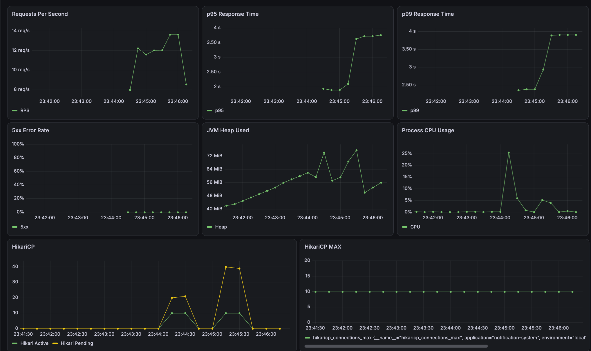

# 04. Experiment

## 1. 실험 목적

이번 실험을 통해 확인하려는 내용을 작성한다.

## 2. 가설

> 적용하려는 개선이 어떤 지표에 어떤 영향을 줄 것으로 예상하는지 작성한다.

예시:

> Redis 캐시를 적용하면 반복 DB 조회가 감소해 p95 응답 시간과 DB 부하가 줄어들 것이다.

## 3. 비교 대상

| 구분 | Baseline | Experiment |
|---|---|---|
| 구조 | 변경 전 구조 | 변경 후 구조 |
| 설정 |  |  |
| 기술 |  |  |

## 4. 통제 변수

두 실험에서 동일하게 유지할 조건을 작성한다.

- 테스트 데이터:
- 애플리케이션 인스턴스 수:
- JVM 옵션:
- CPU 및 메모리:
- DB Connection Pool:
- k6 시나리오:
- 테스트 시간:
- Warm-up 시간:

## 5. 실험 환경

| 항목 | 값 |
|---|---|
| CPU |  |
| Memory |  |
| OS |  |
| Java | 25 |
| Spring Boot |  |
| Database |  |
| Redis |  |
| k6 |  |
| Prometheus |  |
| Grafana |  |

## 6. 부하 테스트 시나리오

### Smoke Test

- 목적:
- VU:
- 실행 시간:
- Threshold:

### Load Test

- 목적:
- VU 변화:
- 실행 시간:
- Threshold:

### Stress Test

- 목적:
- VU 변화:
- 종료 조건:

## 7. 측정 지표

### 클라이언트 관점

- k6 RPS
- k6 p95
- k6 p99
- 실패율
- Check 성공률

### 서버 관점

- Spring Boot RPS
- 서버 처리 시간
- CPU
- JVM Heap
- GC
- 활성 스레드 수
- DB Connection Pool
- 캐시 Hit Ratio
- 메시지 Queue Lag

## 8. Warm-up

- Warm-up 실행 여부:
- Warm-up 시간:
- 측정에서 제외한 구간:
- 이유:

## 9. Baseline 결과

### 동기식 Baseline

Mock Provider는 Delivery당 100ms의 지연을 발생시키며,   
Provider 호춣을 Notification API의 DB Transaction 내부에서 순차적으로 수행했다.

| VU | RPS | Avg | p95 | p99 | Error Rate |
|---:|---:|---:|---:|---:|---:|
| 10 | 17.32 | 576ms | 892ms | - | 0% |
| 30 | 22.09 | 1.33s | 2.13s | 2.57s | 0% |
| 50 | 23.55 | 2.06s | 3.80s | 3.83s | 0% |

30 VU 이상에서 HikariCP Active Connection이 최댓값인 10에 도달했다.
30 VU에서는 약 20개, 50 VU에서는 약 40개의 요청이 Connection을 대기했다.

동시 요청을 증가시켜도 처리량은 크게 증가하지 않았으며,    
Connection 대기로 인해 응답 시간이 급격히 증가했다.

원인은 DB Transaction 내부에서 외부 Provider를 동기 호출하여 외부 I/O 대기 시간 동안 DB Connection을 점유한 구조로 판단했다.



## 10. 개선 내용

적용한 개선 사항과 적용 이유를 작성한다.

## 11. 개선 후 결과

| 지표 | Baseline | Experiment | 변화 |
|---|---:|---:|---:|
| RPS |  |  |  |
| p95 |  |  |  |
| p99 |  |  |  |
| Error Rate |  |  |  |
| CPU |  |  |  |
| Heap |  |  |  |
| DB Query |  |  |  |

## 12. 결과 분석

- 가설이 맞았는가?
- 어떤 지표가 개선됐는가?
- 어떤 지표는 개선되지 않았는가?
- 새로운 병목은 어디에서 발생했는가?
- 측정 결과에 영향을 준 외부 요인은 무엇인가?

## 13. Platform Thread와 Virtual Thread 비교

실제 블로킹 I/O가 존재하는 경우 반드시 수행한다.

### 실험 A

```text
Java 25 + Platform Thread
VIRTUAL_THREADS_ENABLED=false
````

### 실험 B

```text
Java 25 + Virtual Thread
VIRTUAL_THREADS_ENABLED=true
```

### 비교 지표

| 지표         | Platform Thread | Virtual Thread | 분석 |
| ---------- | --------------: | -------------: | -- |
| RPS        |                 |                |    |
| p95        |                 |                |    |
| p99        |                 |                |    |
| CPU        |                 |                |    |
| Heap       |                 |                |    |
| 활성 스레드     |                 |                |    |
| DB Pool 대기 |                 |                |    |
| 오류율        |                 |                |    |

### 결론

* 가상 스레드가 효과적이었던 구간:
* 효과가 제한된 이유:
* 외부 시스템의 병목:
* 최종 선택:

## 14. 실험 한계

* 로컬 환경과 운영 환경의 차이:
* 데이터 크기의 한계:
* 테스트 시간의 한계:
* 네트워크 조건의 한계:
* 재현에 영향을 줄 수 있는 요소:

## 15. 후속 실험

* [ ] 추가로 확인할 가설
* [ ] 더 높은 부하에서의 테스트
* [ ] 장애 상황 테스트
* [ ] 다른 설계 대안 비교